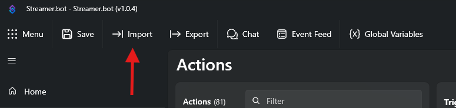
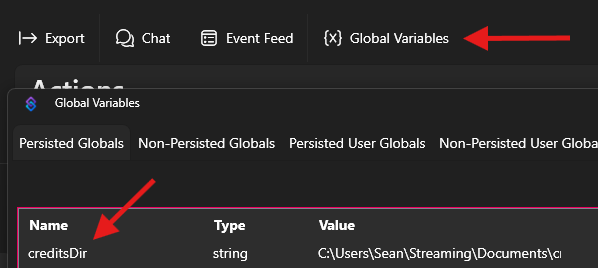

# mr1upmachine's credits system

A chatter logging system that records who chatted during a stream, for use in an end-of-stream credits screen.

---

## Prerequisites

- [Streamer.bot](https://streamer.bot) installed (v1.0.4 or later)

## Installation

Copy the following text and use the "Import" button:

```
U0JBRR+LCAAAAAAABADtXFtzo0qSft+I/Q9ev+7QUdxhIubBkq2bbbUlWQixPg91A2GB0AiwLU+c/75ZoLtQt9txzpn2tDtCbUQVWVmZX1V9mVXoX//9X2dn5zHP8Pnfz/4lvsDXGY45fD2nE5yd0QVnYZae/21ViPNskixEcbyQ83mM6SSc8U3xE1+kYTIT5fIX9AVtChhP6SKcZ6vCmyRIz7IJP8tTeAKuoKmUz9gZPot5muKAn4Wzs0IDP1nA3ZUeZ1E45Wc+x1m+4F92tUr6+eyCruTP8ihal8XhLIzz2NloJgpF2e9FjXOG93qPCxkp3Pm/8s7ZuqgoDplQX/GZamOkSTohpqTZcGVbui8xTSOKQg2N2spaueKxf+Y8L4yqMKwRA/mSyRQKT3ILnlR0ycKccVkmCrP43pN8hknERavZIud7JS80yhlvLJK4FaZZslhCJR9H6alad2DgcBZU1ary+RlmrPDPnj7BIsnnp+BRWjB6xssU3FHV0ALPWBJvHHVUTpMZzRcLPsuqSrNFGATgyF3vHHioqCe0XnVpBwpbJ6ZDqNBmFU3sOFlHqkYNE0maiTG4yjYlTG1Lopbpc1lRTGTb54ePZsu5aFVW0GHJSUdu3ZSukffbbunv2y+/7RojzcnFMVirzLHxbuktCRwrCRNJWSKt7n2h6VFf9sdslSEX3OfgK8qPVCiK639/eBiF4PDn9OHhNqSLJE387Ev36v7hobEApZ6TxdTQHh6eNJgsVKTK9sNDnNJkEYXkC4ui832Rvx22T5YZryes6Bxzu3MS02CoRq+s6WRfn9H14b2baXRXfb/7RJov0Vjtz4miv95MWURiZ4lHt+ZlL+nWZzV5HL/Mx8vaI2k2Xumydjm8mnQI3CPxEMrTbj28CNr12jMbdVJ4LhjH9hOp1xq86Twytx9d16frOkIm/L0oP60uonGUe8va89jtJ+1LFPTkWlvowK5YSpTOhDS8CX18eWWtjtD7f6/rnUcaO1Ps9l/7cZR6g3babvWXbDSci/5tZNdrcy+8SKjah77oM+j/6/3MScmVveyP5GfWmia02UC4Pg381nPQHnpz0hzmfXcyh2der1u1CWsG8+vensx9/ct7YI8gv2/aM0dpLEkYhD1lMmGtfkTDGvSBBl6hZy0nag+ubZnEvbwdTqtkLT23L9NYg3qNlCrDA3uhbj3Y02dtl4BA+/1mtPxhG4pnwucAymRvcKBTM4rb9cn6uXzgdr+y0Ut6r3YaxK0hPpiAfHaF3fb77KR2Iq8ZIcAU6NIRGHyis2mA3duAxDYCfESsroXX92uM7XxanYi1HJBTi8ejl1fvoI4P+uzpcNXtDer6kM6iFti4RmOatGfOq+e2w5t67Ym5vWCNlXaruF/g6QReQ7D3I1ZeBFZ6a+wOCzzpl0SRQ5ATXTdfnjzUn1OwbzvuLr1Rf85aXR/G09NYyVLsdtHNrK+xekVbV0J2z1rrdBfuttkL7gBPnkuD+yaM48td31b6sIlHL9HN1NFEm3Q5OdL/ejA9tnGzA/7tLohoo35ht5t6xJa1WyHjbm2LVy0px6E+8EaNaU/gown33dtkt5+lbabH/Sz12+3bzhgcBnf3WsAGeoO6zoS0bhOYvyJhz+HKLj3FzmAcL6GNJxLqdzSGeQzGzmDEYLx1op7SeAVcz68H27FVYF3gZX8sIcDeng343nxSflZ9rdFWDebJfg3mzqHnTtBqvkhX2Amul7UGmXlzGts5GTk5q+tfPZfdFrj4Np5BDyc6mMvsfZt1oa1uAnaDORbs0RJzN8wZbjDfx2tFO+U4uIVx647dTn5d74X9uAFznzOFefSp3WJgy34EbSSACyT6IuaWr2HNBPn5/ch5pUpj5rno3eNyM5fN0D+Olt75gtMknocRP8VRGI/wcpDhRRVRKvkBfuJ9nuZRdp84eBEK+vGtunu1KmlTSYt0W9E1y5Z83yaShuE/mzFfQr4CzNYyZN+Xj/rzzMNgIjSFmOAEZbLFvyM7YEEFC6ZWpdG3ORUwD/4i2nwLm6JJFOF5yllTENx9Fvb7pmJFKKBa3DR9BNzQ4kAVNUXCOjYk1dSIb1tYZsT4+KHAjD+f+QKNHy4UKL0k6yoiXEeS6esyeMm3JFifwGm2psmqqjKMT3N5XfuJuTx4RhKe+bUI/GVvviXaysuEqrcF4RuM9FQsLlC+IQC05cDCGj3CQv5ElOcAFlYgWQ7yBtuFYn+R+ySUbyaUWzKI8EiOgLBMiHshiNkVLJyR04wyIApfiUpzp2nfr/oMpDPSuTvN7oco85p9f3AVZGSEMvDjkV5bQlqQCyG7IGtF0DYS8obJ2k839YvpLsnkIqCDxZo1GxltoZy1JmgVdOy1AXrp3ycNQGJjCOaa9pIP9Eu4Bn2cqx0bb/SotO1VGVw5amcOz1WQprUt9RUOjvXcIS/3QORa0F4IfhqN3Xay0++C6Ar8lcHdCRwe4AfGTkyWwbQ93Sc9gNccMD2HduYc8C1IUCG39V3y8+8lcU1hjwaM89ojBn3B5su2CEZek4ArjnYzFXjtTjzFsd8diIbrPs2P14+fmMTJtqYbto4li2Nb0jjHEjYZBypiGrrCZJ0ryi9E4izfphZSfcliMpA4oukS1gxZslTF8g1VoT7CH5LE/U/KsxVTYOEHTOTC+ImhoQI755xZlDONSoYPDtJ8nUqW7hPJMGSCFM1k4Lgj0JYO1hhWDM6QZGjwvEYUwLumqBI2wLOWauoQ0ZzifxqSf2L+Bw6WwLWf9O8PpH/FkugAJegrDuq5nRlQu+XYZR0yq8ms3k7bTRv+bmkitPnM3N5h7rVKziPEHdl4pE/F8kxAjx0KtSm7jxuZV7H8r9oRFGhe6HJpCflzAn05kVP6Fs0sZdSnb11q7z2h2zr3MQCqEDmv4xGLBCUYKzZQuEbuXekToFx2+/KlyGffhe0Du6xoXewgBst2u+lNCFDSCprwp1C0XV9VLPkbnx7n7S7sdqOgarnIt42FzzY2fFtu89AGeDQOruuN9+UlS33LZ6MyXyXyjk7TgfaOZdxs+5avcv+nbFDgdgiY7SvQD6A+TtxYVoU3K1ue2HsoP0XYFHVFnrDrud0CL4KqnQpTqCLGRP9JYKqU3/8uPdvkMqtybGXdR7DBI/gwgfH/6LkiXLEBe4721hAL7AHYXlPGYdKpd2A+AOw2o+kqNDHarSzidX3TT3/wbuxv+uD3/vGh8oOmqdicwgLrW6oqaSaCVRYZVPIZQki3sEZt4xeiljLXNIRlXdK5DuYA6gHcEK4MRk3KNdNWdPoxqeWKgZAoodMIpGLGPjjBZApTbUO3gSXKSNKQChY3NUOiskYJkn3TJvoJgmkonEB9Jpm26QM3NTWJ2EyWbF2m3NB0kHAywfhzE8yNf8WxgV+LZv5UxwQqt247E4aiHCguqqCTa3r3fTmxyKTJExL3jreBm+uy/tfxSC637fa3DFftiK3RUpe7JciPowz6UtJTp4vGbgdd19lFZ1lFa4EGbbNfHYp0Gex8R6dORlt9/Xol95AGVW1NnqIbjlss22KJ3qfZLgruiu3KTi7690fR1a391tvfYJ/S9q2DzN3O9nYQjte0qHjm/cc6NpnId9usc7mme+3mLq2uzQHXxTEOQdVu/nB77Wy3N96U8d3aTLb3ttBPZXsPjwu8dYv/MNtZ4Pbq4MjMsf4HWfzysxsiiN0FmEfU4+MOqyMLEdDjUbHNXmydnwgRqsfVXt90mGfgrzhCMLiw78KaDGHHCxs1UpC5CWV++FjB+yn0luKDXu0m6AEhm9eaBiILzJqTqMziirDqds9mfxTu3hRW7tuw5jV7SXXIX35WxyNcwA3yhg0Yl2L+d6qwke7LPp2h/7btGlNvc3Shn4iM93bs7sr/7q7PX5GxP04jTL2JwLlXryGyrMm02Yc2hnv+/jx6cXaOLIPqus4krCsEYgmZSARRJuIrhWPMDcLwLxRa2SalFJu2ZFlIhFaaJmHFZpJPma8SWYNwU//PCK0AcR88tLJMTrHKuYSxOCZjmYZUfJUN2cKyT2XV9E+EVqZvKcQkSELcgtBKRYZkmZo4jK3bMiaGjNXjtP8HC63AwZ+h1Wdo9RlafYZWHzu0eu+Oxg/Yrr57AvxPfKvgTSeh3xtK/uhp8cN2wZ9IUF0yshVvVOwI7vlnGDsZUb1iR6jqBPlm56ax0gmB/93aBK5fgc7n92pnCnUm5CqakdheesPuBGw2P56jdueZHX3uUXBbr9i1qgoL3hrmtNhkPT5Wvn53mPiWUKEaF/+mEG/Htt6s80QGNYRFiLTdRdvz/0+6Y9Ycj8Bu0AfWtALm1qbj4pT9jn0uPw9n2cy0KMQhkop9Q9KY5kuWz33JZorsYyxbtnZMeP9zwzwFa6pObSxRlduShiiXiO6bEPpqqm/72Obqxw7zZvz5Y56t34vwfBVTQ2FEInAhaUSWJUsjqmQgFemWbJqsArWlhzlSCLIVX0I2EsEhtSRiMFWSiYkpMyjXZPVjRHjl2+Ptd70ZUjoun7XjmDOc8Wh5atQV4qmqQQMQEXNDReI0HAbxhiWpBrO5zZApV4TFb5gljl52+ElmiPJiXb8c5N97Tf9Hx38RkP/AezHnp7RbjYyT+s35Ig6zjDPxInrZ0b9VFW8NsWu/81uIuBcYZqH0/IQpw3edmHzLudGtv49MFM6K6a+qKC5zBGjf3YWRvtPeggf8BdhVFNIwq+O5+OWHqhbAdXg13e21EgazZMFrSXZBaZIXE97h5F5Wac8y8asBUUWFNMkXZYpFPnBTCotBXYjli4rnVhWEk09XojjlAz5Lwyx8quxZECUER/UkiVjyfNS/vBBeXfb9VSSAlSK7L0f+ZoxWr8Z/EWZ/9BDG2w+k/DnI/V6rn/j9tfD7o5nut2f9/xr8Hrb6id9fC78/yuPfFM78qdCtavATtX89ag848DMnKcwpPBvwxdMBYreF9SiE6GK/MAvjdX1xZ/VDXdvfFlPU8g5/mScLQLyIt89XPzm2wubxz36VP0gm4Wg+wV9kGAO//z/Kv5pr/kwAAA==
```



### First-time setup

Run this command in your Twitch chat after importing to configure the system. This command creates the necessary files and folders automatically.

```
!setcreditsdir C:\Users\Sean\Streaming\Documents\credits
```

If you'd rather set this value manually instead of using Twitch chat, you can set the global variable `creditsDir` to the desired path in the persisted global variables.



---

## Commands

### !creditsnewfile

Creates a new file, in case the content changes dramatically mid stream.

**Usage:** `!creditsnewfile`

> **Permissions:** Moderators and broadcaster only.

### !creditsblocklistadd

Adds a username to the blocklist preventing them from showing up in the credits.

**Usage:** `!creditsblocklistadd <username>`

**Example:**

```
!creditsblocklistadd nightbot
```

> Accepts usernames with or without a leading `@`.

> **Permissions:** Moderators and broadcaster only.

---

### !creditsblocklistdel

Removes a username from the blocklist.

**Usage:** `!creditsblocklistdel <username>`

**Example:**

```
!creditsblocklistdel nightbot
```

> Accepts usernames with or without a leading `@`.

> **Permissions:** Moderators and broadcaster only.

---

### Configuration commands

These commands update the global variables that control where files are stored. Each confirms the change in chat.

> **Permissions:** Moderators and broadcaster only.

---

#### !setcreditsdir

Sets the folder where per-stream chatter log files are saved. Creates the folder if it does not already exist.

**Usage:** `!setcreditsdir <path>`

**Example:**

```
!setcreditsdir C:\Users\Sean\Streaming\Documents\credits
```
