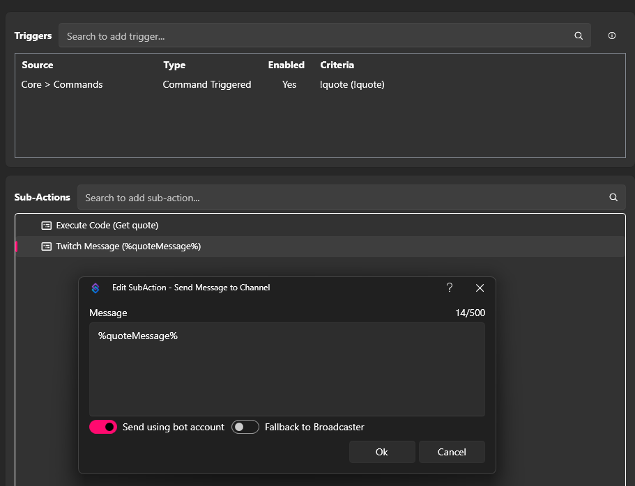
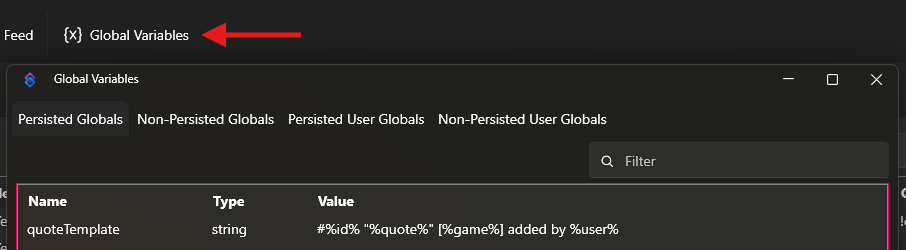
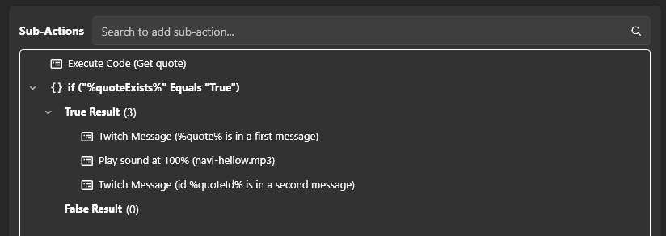

# mr1upmachine's quote system

A collection of quote management commands that uses Streamer.bot as a backend.

---

## Prerequisites

- [Streamer.bot](https://streamer.bot) installed (v1.0.4 or later)

## Installation

Copy the following text and use the "Import" button:

```
U0JBRR+LCAAAAAAABADtfVtz2zqW7vupOv8hk1P91IMMCAIk0VXzYCu2LDlxYsuWbU36ATdKiqlL62Jbnur/fhZIiqJESpG1FWc727srbZsEgYV1/dYCCP7v//0/796975mJeP+Pd/9r/4A/+6Jn4M/3/5oOJub9f6ZXxXTSGYzs9d7ImQ57QnW6/cXtezMadwd9e9/5gD842Q1txmrUHU7Sm5VBryf6evwuHIzewW+i3e2338VDjd9Nx/aPSce8k9NuNHnX7b9rTEYG6Bl9kINJ0uzdeDaemN6HPGWDi2n/QKVj9KdRNL/X6/a7vWmvmVFnb9p7/45bvNdiaeoi7mMMV/4nufJufiu+3dV2CtyhVGLmIq1cD1GHGsQZ9pGjMfWdAPuOF8yJix/719RMY45y18dceAGiRsGTjPmI+2GIeMCkxNwh0NnSk6YvZGTsqJPR1CzdeVTRVJvj0aB30h1PBqMZNApFNF7X6qvpa+BuWau5wP8j5q/QeomG9mgwHWb68E6lAlxqI6IHMRuDEMq6H0HzQS8TT+G+GvTVdDQy/UnZ3cmo226D+PIyWZFL2ktMVy0Wkc8UczgRSEghEcWCIi6URkowo8KQCN/18xPISZcR5QtpFFKG+iAjEI/Qnouwb3zPc4yQIS88OpkNLQcpdlbvrJXgQj7jucr9M3/334s//pnnx3gqD4paWsaRWF5NMepaCuzU/jYSD7X+cDr525q5C66454Mqk1AC24jUKDCuQr4W2KehwlrowqMPptvuWNHhD3gNXxzs+qu3hsJKPBZXzmC35Fu3r82jHXKJY/+5iRtdO/GYC+OpUmY8LjJhMDQjkWppYSr3IkqM+BLoKTxqfdBlMtkyetcLrYTU+InEaEoMYss+1/SbTiXRibPU7udqsTqr4tz/FutUTRd4tyUjsmaJvhEH01AQhWSIHXCKlKGAE4kUl0xhx6jAeGtH2qB3WZu5/hF3XYucGr53tfEC7IZIcm3AsTOCwNcT5GGBCfdCQoy7lpyNCruYd5nizv/7d+lT66SYxKqEcgEWppkfAPswGG4YaMSVTxALQk5MKJmkeC3lo2m/1usZCIUmmm0lN4h73DChkZZCIUoZDKw5Qy71sBTECUPP2Yfc6J9Mak6p1IoX/1lmr90/RO2P2DZnGee8EIRWWVbib7djxnr1LaruSzu1iXlM3LsZjQaj9Q5qOjaHg8kPBA70RaDadxtIjdslMsXKmNCjHpiDFIhq5iGhuEFEE+kSoqRm4V7c2NoGeXvwmOfCsAECOwSQKaSDpOsapLGWHgBXD4j6qV7sWfawK7XPsQfy0+2h4BhWmLDKgDneEi7hXIDOAL4CxXFcJJgPf/qgTW5gpDRFqLEN3iKFO3uBW0vTXAdQ1SCKxHBsdNUmDsvAduEmimnVc2PYK0urXn1ORR3X0b6iCIcBRC7AaChwQo4MDTzAakL5TsFS5zmVqzQOAC+4glNEAwrhDxI05DihcngISZks5hV/ypxqLtOqSasRBbKX6x1ltjYyoQHJQA5SFuPeV/7x7ds1WNzgYfzt2+euGg3Gg3Dy4ezo8tu34xGM/zAY3Xn027d7+gF/cLHr8G/femM1GEVd+UFH0fsf+B45m5jKQMfz0DdnQ9lT7Ss3etLV5uTLAz5dvfbp7uxeVh+jW/diKAl7+nSnI9lrzsT1Z//j+eCs0j90bnuPw9vZ4XdZPX5Ss8OPV0eduoRrsncF98dnle5Bu1Y5uD9t41P4aX//V63awfrk8OlLN7hvkQiLk2b3Uw/GavCJ+n7sqKrTuSUd28e9ci9mrevjSeum3pXu+URX+b08+XwP497fdvnk9jqafiI60hXnUV9z3Gqw7+phMRbQ2U5+h583x450L6Lax0cIPfW7r5a2L6cHUeVw1rq5cFSPPdVOLgatxmFP3NSfdOUw7RPmRxi2Y4lr1rdtbm/O25rwWesgN6/Kcdr+IJD95uQWePW1+7Hbrp+3Va+J9U19CjzConrVVjfNew0/tZ1/xV47xrWj6KiU3qT/5F9C75Oochf6chQ57gN9wJ+zp9trHX2qHN6r7mGndlLvyN4F8DSbw7DVTX9vpveu+PTi2nnQJ3dtcfO5XetfzPT1VTdHw1x+7dPu4dlF8+zy/Eof144vji+bh5/PmxfHVw/5+ePJp0bxX35OTdArVX3sgH491arHM6ALeA+yP2lFrcrhUHYtLyK4B7ytNmdfYC6J/tH27U29X/tI2y0Csu8dj2snrY7qRR3QhSi+Xm32bm+aY5CblRfo8PFUV+hiDnkdPDomIM/x7XV9DDQ8gP5+b113QN8vItX/7C3JoXIQievzaEUGc77WLyqHU33tdFs3tRy/7M9m2uYqvkYHlatUv+bP4tZNB6+OBXYYqe5VfqxYZ5Lrh66oBm2Q+7BVWdKl1bH7t9dOVG8crI4dX69V61Giy4fj25vI8h76bU5rJ4nOtSoHA3F925Y9PrW6A7rWk25z2qo8wNhNDH3d1yr1puxNptLV01r3bnV8y1Pc6vGZhPnnxs9dP4C/Wf9T9/DK2sEtaQ9XedGybRsrvAD6wS905M1BO+7n+hiDPt2BPoH9Rszc3E0ur/CkVT1fI3s9lgRsoHJIQKeGsQ6A/p+enIEfOSTi+qh9Zee4aHedtWscPunrGvidM6CDT62e1qpHbXnNYXzQ42sHbOt8+CU/HvxMZNS8aoG9xfNvLGw65U0kb6wswN6rrcSG4ae+ZndzmSzzJtWhK3avj5J2TeuP4vuJz5HXzafUPySyrbL7eV818LG6ejaw876F+9Yf1mD+MM/v4qCU9i/wXDXWgaPobon2qpXHWadFrD/rRGDDUznLdHwCc/ouYnsHPoFfbFlezsBu1o3jJDSq2QqPiuMs+VIJfgPkZ3XV8hKb89L+mwlPcj61pH9FOvcafE5uPkMJ8S7t/0H1OOhJYifga8amYX2x1cGoN+fxVe942qryySVhxzE9qR3dXj8+tRor9rL2mUzvwX8fdPVJ3Wk1auNFrAHZ3lwMYtlWo6k6sbZZj/RJcyb7sWxnt6AbkuCMT2D3Nr53wObvISYUYsga//9V31w86Jtzr1wPF7xb8DXRQ13tRJYm5YJvBhpbs8VYtUoH7Onsu/07saVWR1w/DCGOPbUgxt5a/bxOfD/42Ej2z2Obr500n6xfAtnA83Voe+y0rhnM/cy57TqdOWYpp7VJxc0ZzutXRivI29IL9mdtEHzbnP7Ubk50J/OF5fpbb1WWdWth42kfEOdh3veAk1gt8Tk2NndKx6iU68lq/yVxKY4tf3ScZhxzSsex+g5y0AOwDdfKKZ3/3R8d84IA3muUjrl17EptMtYhG8duFzE3phV0yLF+ulQ/mrEfBhrrk1X9SLAL+Ocebp9W+VQCdorjobV78G8LXAexKPXfp+V+6Cj29WV6Ur3o2D5+ENt2Gj8/34ubTsfGnFhX5nHpcrAsk+O5vn1OMVB7jk/GC4xx5+WwTu754Kwyj4MnhzNx04rndUv4VIFdWWwfy/EIZNaDcU4u8vGRA764SPH09/p1dFe/HLTrKSauN2r+fC7qpD7UveM5Trcx4An8ZJzLXMwx4VEhTtr+v2RxaqETMX2AHeH52FepWreZ+v4m/L77uI3r8/bXxkH3shdkcpqPmeYBgCXTue4wv6tEr55qH3G7dreI9Qt7e2afx83ER9v+ouT3L92Dzpz2ryca7OD877HfLs19No7XlYSPc7JvJHHK+SrvIEc4uWB23DjeXY4XelQJ/lU7hlgCz+re1UKH8rlAtTWz8W4RMy7S2JLhuTifS/zj4L6ExowXV73mkySPpNWEeBHrQye7Z/tvkCb7lOPdPDcpXM942urIk2aU2eRJliPH/6yvOrV5kft5ej7Xw/7Zp9bN3WA+3mnjoFe3ckjn/ukuerrsN8fyiM+akDeDDlwqm880OsAT/XRNoD88iUwTT5tVfpnSNDht3A1Xx09oSvED+O2Nz18uPxsu/Iz1pQWeWHmeO4c1W0fQc2wN/FDfH+dt/346l9ERjNd4SOTfuPMXfgv+WV9XaW8z/76s8u4t4InTxuFyHwmNad6/yCm/PCzNgS89s+DLXesafNn1I27CM5AzZ31bHsx//zQbLPSnker7fvU06TOzh2bF/g15TKqrsfys7sC42bWUJ4/J9Wr9XpKHn6CfCW2foouZaQId/bMoee5MztvdNNiVdOZ0tS3mu9cW8/X4Pczd0n69jexsf80fym51/g/gi229qj29gPh5kcof+pl9nbd9ooMVe8aqD7y5LOFJ5Xiuw9PGzdkX0I3xpVu/EdUI8MTZA+SLUabblbt2vXubzpNdqX50DnN4yukryIU7mY+sLmwFnh2apXkm/+b1paW2Hzfa50L3V2Sf8fEEL/vdI4t7IG+s5PFc8yn2v4A9dFbbgRhv89YUO1xAPAf8ZXOmB8j9IG+GGPUDv3uRYp8kpl0NFn5+kSeDPBJ8cGXxEmCfLKda0ZeF3S5wToM1WrYfK5dKLcE23QfogwF+X9bL05W2afybt08xyt0UbD2pIzXa3foN5Cc3tXmbZoyVPwb/VavUuqv9tWK8e9WF+TyCb+xA3v4lxrlr2ucw6Lz/81xN5b++zg66te4KPdcxppy3v8rVUJZ8eq2/hDFh7Lv1vi3BnZCvRjYXdqxNzbEByPReVZszyPcs/uioxBc5MLepPvmcYMNEVqAXEYmx8EnrHuQQ95timUMbf06X9ehxnW+KY0sEOceR9TPNic0HTyv1NOeL7hbyXYknR2fnjQq7BHs4zGistLvpXBK5RAkNq7a/ccxmrAPp8/Hv7a9PQRsw5HDFV8V+yM77fJHngizy+RDk/CdH0/j3KwY6crVTX1cL3UnpyuU6c317zhxj25vzCHJusG2ICRO1bENdcwN61XDOLhvOHeDQ4WKM2E8v1gm6h+fi+mwE+Q7g1ZyPz9UxwFeMrZ5kdZ+sznXwr08PxXxjkWcA7jhOa9/NVJ6LuJDzDQ+LZ6oLXL0+JjJsa3/a/sxjnFRvIU46VgalcWPxHK99PBhuinOyxy/SXGXFvwGm6B4SiOlDW5tTM8htqizSs8PPts7xFWxUf6SF8eM6SqUztDUVYfOtj0d+rXrX/gpzuE1otn+PTmd3S8+VxZ94LokdnQC9qU/sgO886ECcndp4eHpefG5Ov6xGkB9dPH26Owb96AzLsGURA3Zyc2YfbY6jIa+DHOuhbKxFjFzIdMV2Yl6oavRdYPAXH+e6dlFvnZxJ2Wu6tbn+NACv3LHInJwPFm1iTGT5NrxZoR/azEAnh7dkvIQ7sviWjrk674IvTPpYtflMR1bjZi4mj2urz67E96V1mmROyTpNut51m68T5GJ1WmvJ1shsfXRlPaXd6tftWlRcrwWZjaWrbd3G1mem+XHtfNWsWFPU1cCOf9e6OfsO9voAccViaui7HtfKbQ6dW2NLa6xJ7QniPsg10bG4ZgRxVFT52K4v1eK1piQ//5Sr2ef8yHyNM8XaST82Xi3Wstbik8T+FngyN/c1WMXaKuih1b3PK/hN2zVR4N+ptdHKEpb5DD65r6vtZf9Rltsl/VsfPbO2skTvnY3lTXpJbgf12VUf6C/YYc725n0E5X4r+Xfbr0e31+My/B7bWsviRGtnC15OG3ANcp6vrW67X2+oOHcBfAw50Lj9eTUXTPtqdQ8GSV8P7c+VuyLNSbsu6EhHPJXlvFkcWNbd7gqPojPntp+rBSQ8GIHvBJxuaywHkwW9eCO9dr63pDmA/BDmW5te2ufdi4Fdy/xcSXL8hb6Af8vsq7NC411Z3CgZN/WDWWw7HkO+4bauL2I9tXJYGi/xp38H+bYtpqw3au3T2eEiz+nxoewCtoR4Wbf4JOvvfGhlVetedWsfgYYeu5e9q+6XkrjxY/zVPMvWCgC/1Sv1+lpbrjT9ZZ7Web2R1G2zeQE9hizPO2ysYqi8XmS5Q+JTyuxhyY/mYqKNqYlOWP1Yidmrzyx8eFbzKuCjwwd9XQe//HmeI1/H8c/6gBTP5H3SOrxS5qus7Iu1rkwGubqsXXua49vc8yCbRd1wcX3Vf6R0D5WTyhDGzcWa3DidJTwWx96jx6Fyz4M5/V+7hz7QMgQ8uaApoS9ZmwCaaj2bT1l8etBVS9j3oJusLdfa4Zr6EuhGwt/YFpOY3Typs4sUWy8wcBanuvMaxsLGsnvr6hgb8fplhm3jecmCPJoY7Az0KzfOljWsTAaleGBD3LtaXQ8+juvAP9a3akkNflG7yuWg6dx7HF/E9fGLm3h92spzw731tf5V+SY1r5x8+bq4LlfGAflOWzeqfWnXmj8u6pYwZ9C1dP21e8jX1IgWel+57aV+z9Z/ThLfp8rlntSCFngru1fq93fRpxVZXmjIA62vz9ZpV+ezwNLRU2K/56V1AuBHF+b7fc7znK1frO5faFw/T4eS9ZTDxnz/0FXaZmGXS20TH1C2l2GN7sAzq7aU1uOyOdvxcz445/eW6Rwv5WM5PGggrkI/XbC91bFijFC7Xoxla4ZJLn4xM1c6ycdn5XES5oZzmGYhx0YJNnpG/K1FkxLevqy+ZPn4Ogy9mPc0t5fkR75mnlsv60n2fC2/VpW7/od8y3zMdfoxOH2p2FSSL2+u++T7Peheu6t8PHs5nWgma5Nb6EO612WzLjRvFvNa3jO0pAPptd3lr5NxfhvZJ3xrvqDcC/tYt8C8yRrHVmuRGc4tjNPduBaU6RurK8wcWX38qiI9EBY7uYeQn1zFNSN9Xc77jD8n8X7cEh2I615Oy66f4cd7DVgXdL9du8TZHt4YX6RzhXhxf2nznZvaIKnHAfaF8RXIb3n8veHTwlr+TeMwl7elMjh+6MbYdf63zRkjuJbs9Zlom5NW61HKB4hptXZGd2ketjlXW7f+9Yx8K1fbXNRaluuhC5wG+mb3y1mMEK+jx/vp+xcdu/8uXiet1Ge3N7qe7C2pDWsfg3gtUznjruodu43k+W5hnTSyuoytLD1br/+yZvz8etxGnLSSx2V+cPG81fejbM17cX0Vsyww6io+35xfruYS5Vgtu7egZTUPKPiaPwduzPNlHvN/SEO2n2c578nhlCU+zK+vHTuNNz/QheYC6xXiYU4HbkpzzXSPQ/H9gvyY57EtZbIv7vvJjV3cD1vbuGdoVf7L/iy4z8fiuF4130Of8sG+nyHt/uH+GfiGq3jvp4nt92q+7lSW122uwzTucjHP+rqzqBTrN7fIsffRF+guxIvhj/zlurnldO2P0JPiJ7u+ntuLkPj3UtyzVfxfQ09ujXFznJ7rUbqXejVfKlv72h4rzdcw83vcgna8DpTqeem6TX4N0vr8k2Yprto2BpasN3yfr53VVtfwrpL1ydNCDSXGId/Xr7n9QSyRn/N+5tlL1zpjrHxVPZ6Bng3SGG2vDWUzqdufVtT3+uxuXndJ1gSzvd13P15jAbxiSnBdme4k7eP128eytePTdJ9NMabk/h2fLdaaLX6YdR5LefZcGcz3+2S0LK1tPRbyk20xbCXDWavXvsfvilQOBhc3ne+tm8P4HZsyjLyWl8+oZeQwit3zU74fKJP76p6g0nUdvupndtNV+/6Pff/K7iuwsfPg8cvMrgk+8Pk+A/v36Wy8hS5u0K3qXalOJb7xKM4npN1XmeSZ2R6Y/Dphaj9j0MGENxhi/I2NlxFgPTq9BEwGbTryKOoDv2fgTzpgdzAXum6/w1qdKq6FH623iWfoweY186PyNdCE1jU5RJ7/eLOsd9PXpBYd1aNkvetqsNijHseZ9PdV+a6Ps5vybrDF6NZtbsp5IBf+cZxMcyj7vidgtxiDL+VTZbLcHFvn7/HYvVHp+0WrcWpl3uCXnix+3bhGUj2L342DeHFsqmcRxGn7/umPbe1ZdVT7rmDTvutq61Ju8u6Snkli34csX4/cmhcp7vlDObLV2z7+78Jr7sORUYPesBufLFZ2Rsp7bSIxa0zEqOwIguS1e3FvLsx4Gk0uB7lzykoP0IKmS43eh4PBmtMGAoYDRoWDRBBiRAV1kSDcQcQPjKOMdohQu5yqwe1/v/oYs+yYm/j0gc9mPBZtUzzKbNMpNz863WZ+OBdWEmtpkDHSRdTBPgqIJxFViuqQEY+4hcO5tjsM7hWeTaKMYNTxkHSdEDjgSiQdw5HwNQ6oG1JO+Cs+mwRM9dUfT6LdQLqKMKT9ELhNNKirSzUS2A1CQ40jw+IZI+nxJBz7nlE+UgEloOmCIBCNgv9zGcNeqIV6JceTpMfzbXXYIyQ12sVaIUyMg6iUPvBKhSigQhrqY9Bqupt9u96v9pJvhz1mT84Dxnlsyv8vO8Hx3cj0BvemoNjZgz/hoDRHcepTA9EkIBxR8IEowJ6PtGOEj33fVapwLGvWxd4PSqPW+RLB7Cl8AlEcUhQw8PGBL0PjBAEGD//nOShtV2r3eXDge4cSxmSgkAglCFByF6KZMQiHxg2VG2ARlp5093a0YNboeRZDiOKAv0LkWzsBLEuRMOCzaeBJbk+PDLz1h/nt3WICqo2QDkOODjUoopKIq0Ag5lFXGewzgdmfx2J2pXafRwu+hMXsePjgLpT9tocPSgd7BhA5EtwyA2MGdiZ85PleQABQarV8Qt3rAfhjM4lD/kXsIL/0j3rDyezVo32Cjcuww8GY44TMBEgqwBQOCTkLJKi1kuvKA5hzX4QMeYEBtO9hD3EHpCYpVZIHnueR4tnwf0q0v3qOdzsaSBE1xSi+sBbTblaHuO0PEG6aFEP8CR2pEQssIgHmWR5KpLnGDBipmFs8EHIrB7J6WveL5w/jwXSkTHlmsMzzvy0xvZhmDO2XJ8aTtcRpM550+3Eikq9uTUxv2IwFVnwgFNNo0kylWcaORDy+6zHjGjARn4Fj8u3hsqECO2G+tIfOQvoX7Caegg38BP++UTw5pr2EjDZpw/xg/PXZ9la2ZBSgEg7BOHSJQZS6HpKSuiiEjMmF7IgIsqOwVhHKfoRFtheWeTRqmpw4Wtu9Ptszk84gfhw0v2vPqj//sRsbTftf+lfdy87ICL0GcP+xKvS9JWZNoAk9X1HCBQoDag0QAg2EpQBhh7leaHAow8Kh/NvWoYOfIlV3e6kuKiwxC97qK0l9xfrtSNiPFJnJu8ngH+/WO4ash72mjSMzjGZpBbA3bm/6VEeaBnhYaqp8ZIT93o2PISFgoUQMax8DeDWuLlhj1sUzMkzmbZViEuI7oTYKuWHAEHVNiCRWCvnG5ToApEHc9Z+WePEUc1dq91uUYULg0HXBsdjKt2YB4piDs4GYQYULKLdY+d6OXX/mosxmDJA1eyYWyJ77ASZYTGAdNshRMMcIGajb0+dzjK8F8wnk7aEE06WORIFrMJKeMpDXKCr89V99edbnc8rKHAmbcnrIXROE1GUIuwLiuhdCPqBlgELNuaOw0tgt+Pqsoxf/fM52C6lZ81/rpDlxAy0kQAnmKUQBPSHhOA74bCZo6EoZspd00i8o6T18cmdXavdbB/z5TnrXOuAOlP3KOiDdpoiyax2QYsc3hFBEpAt5mFAh4r4myDhOKAMFEd1/5XXAyxShvvoSoNAE7I4IpALmAte5XRoJDNKaQcLlG+niYmqRwjZGmWY+Q1yCH6AA3lBgQO+JFJx4zBDPI79/CbBME+JmW1UsiPYZd4WLZAiol2rQfMgbGFLMVwJMwON6R7fxVv3bQ/XPOOCPpGIolJQiKp0QVFyESAeAE30ahq5XLJC/Vf9+TfUv8AhEWwIistGXBrb6p8CzUZdwJQj1tLejLf3e1b+1HuzXFv4ks4AzoMgLJNie0QwFEsOfRBgIPdxxtHgr/L0V/n5tTolBJ13tKGRc4oCr8TTiXEuEMcdYKeKBQb5gThkGgTbaB/ym7LcQXQDRMmDxB6h9xTxIfDd8C/jFC3+7UrvXwp9rJGT/WALmUoCAmQeAVjOJtADSQrsrrBg2tmPXW+HvT134w4YKHrocuSSQoH2+LTtDEkR8Dv+D/IfR/XxwdrvCn6dCzI0x9nuOkApwygHI6ABxB7IAERJf8MJO4qyjt8LfJklTEcgwYB5yOMBD6vngZ5gyyGAJWNGXyqfrd9zt30m/oKT3UPjbldq9Fv5ewEnvWPjbhbLftvCnieLYuBoxx4XEy4HQHhiNkdJ+4IMFKscs7Qp7fYW/s8HkeDDt6+vBaLmE+RqLf8w4mPmgrJ6kIC4qFQowxSgIPV+SUHFHFl9eSZNtExriOhRhSu1G6oAjEQqCXKGkgOzT0KJX+P2Kf+u0IW66VdECDEVK5SmkcWBDk30/EDJ70HssqONIxwt22t7yVgDcSwFQ0IATxhjyDMag5rY8HjIHcjzX80KNHZcXtia8FQB/UQHQIVr5CgIPCz2wJcgukXT9ALnKxaHkQgdkt3dtf/MC4EYv9muLgFga1wmwh0CyHLCBB/YnPQdBbsZ14PKQuMVt5m9FwLciYFmjn5ZfMleHros5CqkAHOWHBgkfG0CwxARhyAz2XjS/9AWRXuggl2uKKAZsF0iIYb5RIZDkSIXXv+724kXAXandaxFQuQwrEmrkAy02/aAIILFrXxj0mPYE9URhoW87dr0VAf/URUBKhc9DHFjUTZLt5cKXLmIsJMT3qCM2bMLafxFQmpAJl0AexVwghzOMpPEg8gnwLwpAvdLra5JvRcBNktYSO4RigkKshEVMBAXMALLwpBe4CqQdlJp43MX+nfQLSnoPRcBdqd1rEfAFnPSORcBdKPtti4AcU8lI4ELyBfkJDYlGwvMVwsK+/2sCQ+kr3/03T5hqr78E6DlGM+z4yPeYPRoBCyQdYL7wOPdd1+5PKxY40tyMKha6DkNGx6sqDvgE6SrEJAs8YVhoTPHV99+2BFjbsQDIQ5cqoyTytWNPcwF+cuKAzgvtucLFQejv6DreCoB7KAASjwnftZUk4tgSOfaRoCGgBgaAUXEXUpUdz3d4KwAuRtpTAdAzhrskxOC9AoyocgwKhBcCmCdcamb3ne9YTP9rFABLfNivLf8pzw8wCA5gp11cVRRwFQbnaBjGijNNnd3eqngr/72V//b4Xpnn2FM8JCKMW7ejHCRBb5GnQmoPYwOUtJc3CLfNLD3qUuxiZIiwpyDY83i0B5COK2WxmfDp+vPhXrz8tyu1ey3/hZ7PCAO5hRJiOw18Cs7URnmI/o7AruMFpW8GvpX/Xnn5zxAP4B2kP1r49vhOxu2r5yEKuXE8bRzq4b0UhbYs/wW+ZIKCHWhi7FuEmCARco0MD41iPvfwBk/yVv7bJOlQQJIVAF7CxL6tRm2OC0xFAZg+lY4I6X4kvaWTfkFJ76H8tyu1ey3/vYCT3rH8twtlv235T3OwK0wDcKkOMEMGHgqIa9+yD31uXKqD5UPlXmP5L0aqy4W911j8A2jK7WumiHJhX7EyzLpDjLDvEic0XPLiScJzj0A4C4gHsE0LZWGbi7g9+VFBUhYaEnhOyb6137D4V9SEuNlW5QrqCsY5oA3D7fGLIbY7Lxmw1GVuSIwwhLzt/fuFe/88RZTCDiKh3dXBuQtJSaiQ4kIr4RLX2/Vo17fS32KkPZX+GNFEKCLtMcX2wwWeRkJRgpTrMF/4vsNF8TCCt9Lfeg/2awt/JGDM+OALPeprsD0AUwHlGNm3fhUjyuXeTls53wp/b4W//eWUwlfKDyzUdRwwRMJCJLAkyPfBJqkSji4egpx1sf+ckvmhG4baFtC0b+uQAQo0pwgwHuYSsjSxIcV98cLfrtTu99Q/yfzADwIkPPtRpkDYt7cgxeXScJ96IF1cOGRgO3a9Ff7+1IU/onHgYEhYDAFcRz2mIM20BWgceAGRoSAb9sjuv/CnDLaEADlGQ+oLwB8J6hkkpYNBBQ3Yw9upf3G75ztpIgLpKXuCNzCU2vOguREYgcMJSeB4Qnvr37bdv5N+QUnvofC3K7X7PfXv5zvpXU/924Gy37bwZw1NGB3aT0LY0zwwQQF2wK9SySXXvkfwUjnj9RX+rqyfe/VVP9/owGhArb4KVHKSZ+B71HpFgQNKQiPXHfnn+wRArcdQiO0B+yb0USCVRK40LOCO9Bj5C7z1W1CDuM1WZQpscBBSBqDXt6eoqpAgqT3gIseh9jwdlh23+FbyW77/E3f7SUhIsAu2gKVjX/f1kTDUQw72XMkdg6l4e913Kxm9QMkv5Ip5jmvf1bE7Z7GmSCgJwE7wUDpGOODJ3kp+xZJfufv6tfU+LTB17L5z38N2FxBRSOjAsYdNS1+Htt7+ttHvrd7369/zDaijJeSOmgBOlfbb1fZjv659Gx2Hdk30Jet9WjiK+gr5DqS31MEA5FyXIeOx0IX0lqsiGss6evl6347U7rXex0JIZ5VvwHsGthgAzjSgLLAvbkM2K5Qv+Nt7vr9jvc8eOa9xoJGj7Wf2hCMA4wlQQeZLxiijxN3Ltx+2rPf52PiepBiF2tiX3iEZkFhQxNwwgPhLuUcLy5VZR2/1vk2SDkMd+hSEDO7ZbukkGjJbKey7mCwEqwcOv6STfkFJ76Hetyu1e633vYCT3rHetwtlr7vel/wyb5+U7JbiT8n7v8+t5slooO5+UIOLPc/7dWRldbc1hEGE6nUnEKGuxmm1bIkD2e0FB/KMe/8Z8jAA6IPRyjaJ983a1/H7NWxNDYopyE6JQEIKaQ2KIi6UhiSVGRWGRPjLBxgtio7xjMXy5x9yYi9wqtuPa5plt3oDvRp25yxbGurb6Fv/P+BnwuylMqVpm8ejx2HUVd1JRQwn01HpSCDJMpjxvtvuD0Y2KhwoNZj2S4JD2qTWn5hRX0QlDRL4YKXjrAjPoo+K7daMSp5LG1jRr2+kxNg0TH/cnXTvS2eWYKHKYBDpwUNhftO48/J7yzXilfKx6E9SDJPF6fIa+/NVuEQbqeM62lcU4dD6L8UlCpyQI0MDDzvWgTnuBm18KVV8U71XrnrrvOdGV6ndQLqKMKT9eAuf9m1irZHAbhAaahy5/LLninJqE72Ufq4O9aaifxEVJdi4DDscMc/u2FYmsJ+Y4cghIWeBlIFaebehsIS49lPLP0lffzzum/L+RZT3uZ96KyrvpOyrdz9Xb0uHfFPZv4jKPveA8mec1/5z1XbtsG+q+xdR3ecerLX1KWMvo7i1N7X9S6rtc18J3fLt2J+ttCVDvqnsX0Rln7ufcZt9nT9XX4vjvSnrCypr8ku2ePBg5Hig7sykYUb3K4q6uFmJuqY/Wb456fbm7e2VxAre2z4SEaWbMt+bx+FgBIpu9xtbQp0P+EOKW9/3uv1ub9prZg/FdzES0bAjPjig+v/+//QMvWNg8AAA
```


## Commands

### !quote

Search or retrieve quotes stored in Streamer.bot.

**Usage**

- `!quote <word>` — returns the first quote containing that word
- `!quote <number>` — returns the quote with that ID
- `!quote` — returns a random quote (configurable)

---

### !quoteadd

Add a new quote to the quote list. The current game is captured automatically from Streamer.bot at the time the command is run. After adding, the new quote is retrieved and formatted using the same template as `!quote`, so the confirmation message in chat will match your configured style.

**Usage:** `!quoteadd <quote text>`

**Example:**

```
!quoteadd I can't believe that just happened
```

> **Permissions:** VIPs, moderators, and broadcaster only.

---

### !quotedel

Delete a quote by ID. Does NOT do a quote lookup — you must provide the exact numeric ID. Use `!quote <number>` first if you need to confirm the quote before deleting it.

**Usage:** `!quotedel <id>`

**Example:**

```
!quotedel 12
```

> **Permissions:** Moderators and broadcaster only.

**Validation**

- The input must be a valid number — non-numeric input will return a usage message
- The ID must exist — an invalid ID will return an error message without attempting a delete

---

### Configuration commands

These commands let you and your mods customize how the quote system formats and displays messages. Each command updates a single setting and confirms the change in chat.

> **Permissions:** Moderators and broadcaster only.

#### A note on placeholders

Placeholders are special tags wrapped in `%` signs that get replaced with real information when a message is displayed. For example, a template of `Quote #%id%: %quote%` might display as `Quote #12: I can't believe that just happened`.

Each configuration command only accepts the placeholders listed in its own table — using a placeholder in the wrong command (e.g. using `%quote%` in `!setquotenotfoundid`) will return an error and leave the setting unchanged.

---

#### !setquotetemplate

Sets the format used when displaying a found quote.

**Usage:** `!setquotetemplate <template>`

**Example:**

```
!setquotetemplate Quote #%id% (%user%, playing %game%): "%quote%"
```

**Placeholders**

| Placeholder  | Description                   |
| ------------ | ----------------------------- |
| `%id%`       | Quote ID                      |
| `%quote%`    | Quote text                    |
| `%user%`     | User who was quoted           |
| `%game%`     | Game being played when quoted |
| `%platform%` | Platform (e.g. Twitch)        |
| `%date%`     | Date formatted as yyyy-MM-dd  |

---

#### !setquotenotfoundword

Sets the message shown when a word search returns no results.

**Usage:** `!setquotenotfoundword <message>`

**Example:**

```
!setquotenotfoundword Couldn't find any quotes containing "%input%". Try a different word!
```

**Placeholders**

| Placeholder | Description           |
| ----------- | --------------------- |
| `%input%`   | The searched-for word |

---

#### !setquotenotfoundid

Sets the message shown when a quote ID lookup returns no results.

**Usage:** `!setquotenotfoundid <message>`

**Example:**

```
!setquotenotfoundid There's no quote with ID #%id%. Try !quote to get a random one.
```

**Placeholders**

| Placeholder | Description |
| ----------- | ----------- |
| `%id%`      | Quote ID    |

---

#### !setquotenoquotes

Sets the message shown when the quote list is completely empty.

**Usage:** `!setquotenoquotes <message>`

**Example:**

```
!setquotenoquotes No quotes yet! Ask the streamer to add some.
```

> No placeholders are available for this message.

---

#### !setquoteusage

Sets the message shown when `!quote` is used with no input and random quotes are disabled.

**Usage:** `!setquoteusage <message>`

**Example:**

```
!setquoteusage Use !quote <word> to search or !quote <number> to look up by ID.
```

> No placeholders are available for this message.

---

#### !setquoterandom

Controls whether `!quote` with no input returns a random quote or a usage hint.

**Usage:** `!setquoterandom <true|false>`

- `true` — `!quote` with no input returns a random quote
- `false` — `!quote` with no input shows the usage message instead

**Example:**

```
!setquoterandom false
```

---

## Scripts

### get-quote

Handles the `!quote` command. Resolves templates and formats the output message.

**Output**

| Argument          | Description                                                                   |
| ----------------- | ----------------------------------------------------------------------------- |
| `%quoteMessage%`  | The resulting message — use in a Send Message sub-action after this code runs |
| `%quoteExists%`   | Whether or not the quote was found                                            |
| `%quoteId%`       | Quote ID (only set if a quote was found)                                      |
| `%quote%`         | Quote text (only set if a quote was found)                                    |
| `%quoteUser%`     | User who was quoted (only set if a quote was found)                           |
| `%quoteGame%`     | Game being played when quoted (only set if a quote was found)                 |
| `%quotePlatform%` | Platform (only set if a quote was found)                                      |
| `%quoteDate%`     | Date formatted as yyyy-MM-dd (only set if a quote was found)                  |

---

### add-quote

Handles the `!quoteadd` command. Adds a new quote and then runs get-quote to format the confirmation message.

**Output**

| Argument          | Description                                          |
| ----------------- | ---------------------------------------------------- |
| `%quoteMessage%`  | The formatted confirmation message for the new quote |
| `%quoteId%`       | The ID assigned to the newly added quote             |
| `%quote%`         | The quote text                                       |
| `%quoteUser%`     | User who was quoted                                  |
| `%quoteGame%`     | Game that was active when the quote was added        |
| `%quotePlatform%` | Platform                                             |
| `%quoteDate%`     | Date the quote was added, formatted as yyyy-MM-dd    |

---

### delete-quote

Handles the `!quotedel` command. Validates the input and deletes the quote if found.

**Output**

| Argument         | Description                                 |
| ---------------- | ------------------------------------------- |
| `%quoteMessage%` | The resulting message (success or failure)  |
| `%quoteExists%`  | Whether a quote with the given ID was found |

---

## Examples

The script will set an argument `%quoteMessage%` if you are sending a simple chat message.



If you need to customize the messages, I encourage you to use the global variables feature and set one of the **inputs** above.



If you need to do something more custom with the output, make sure to include logic to handle if the quote exists.


